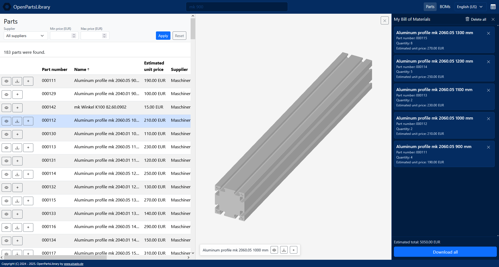
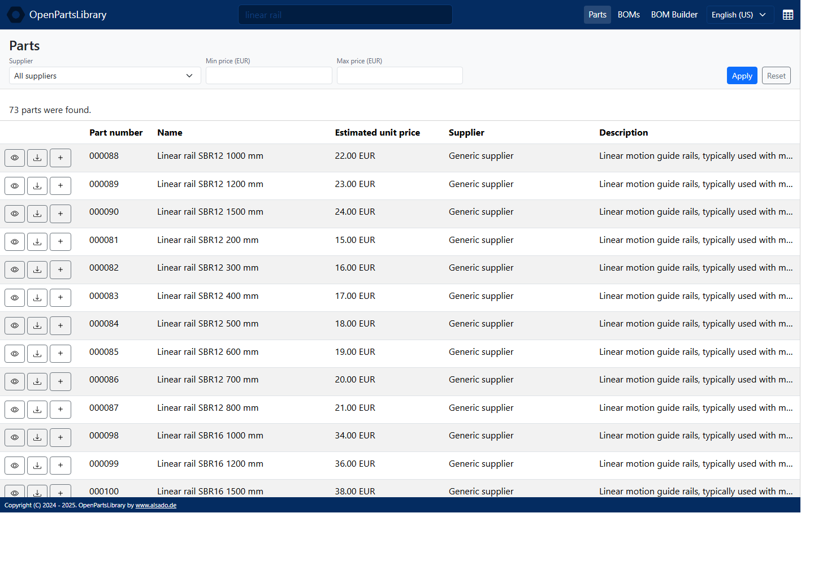
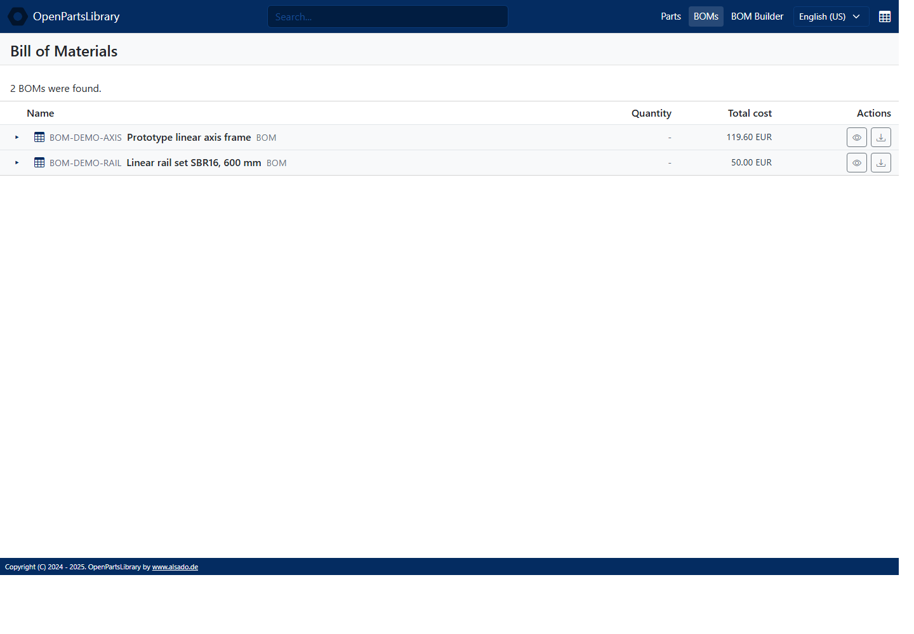
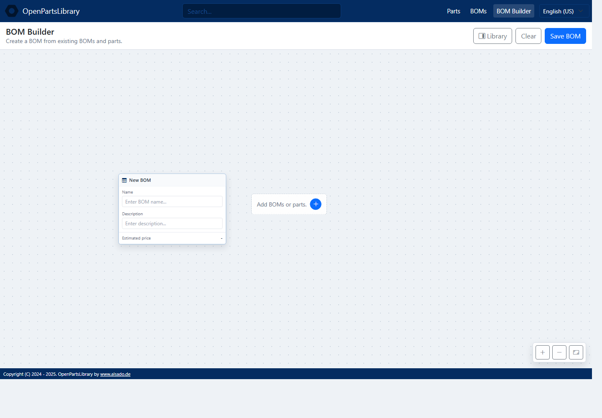
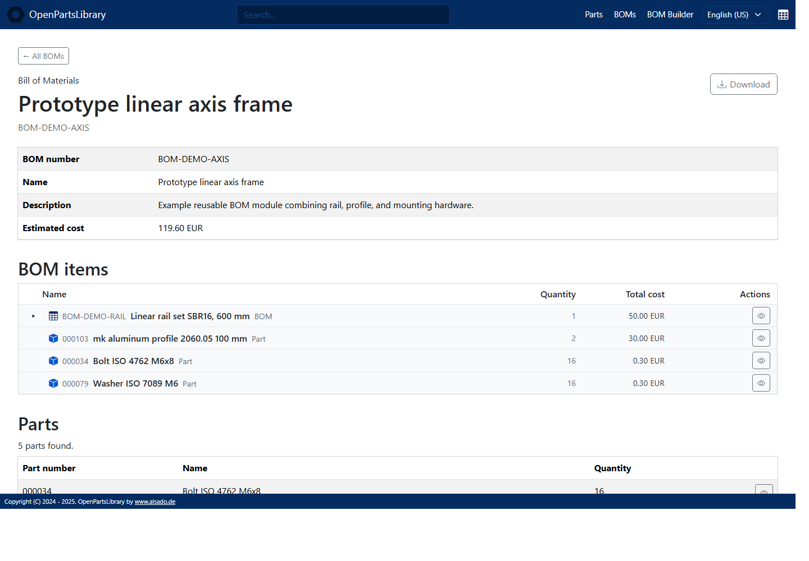
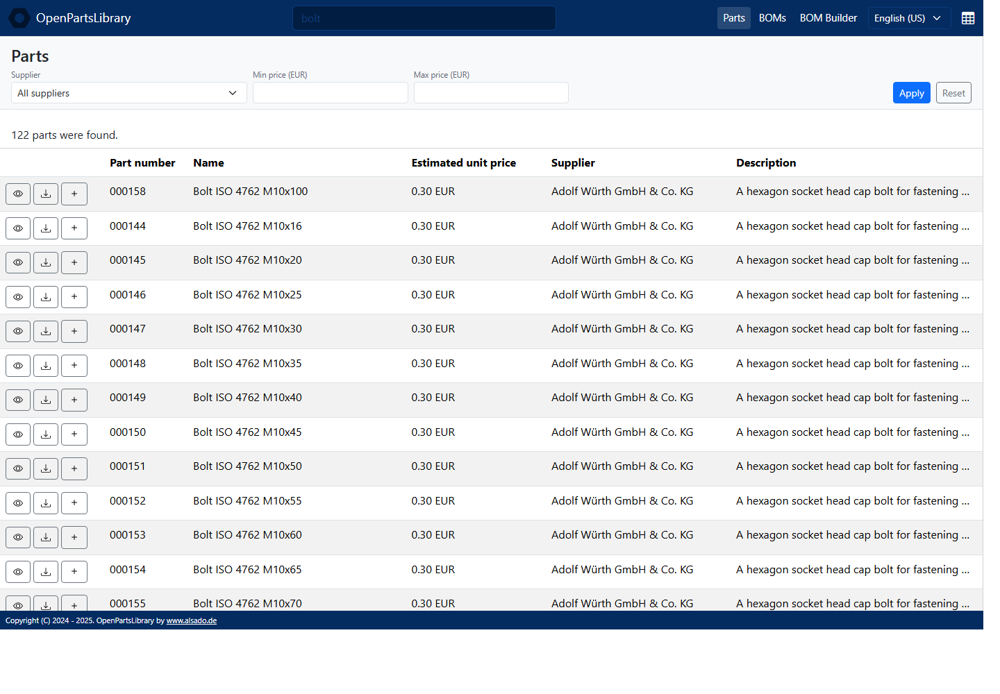
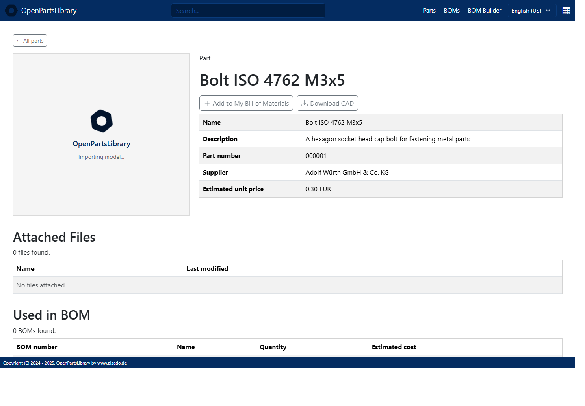
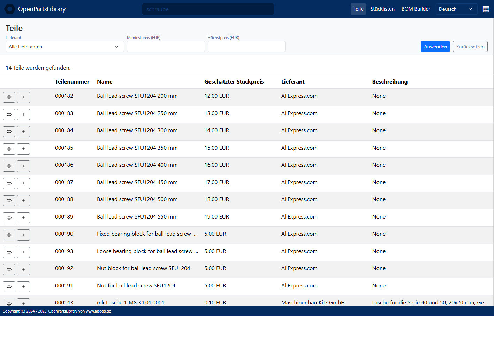

# OpenPartsLibrary

Build machines faster with cheap standard components and ready-to-use CAD files.

OpenPartsLibrary is for hardware startups, small manufacturing teams, and mechanical engineers who build prototypes, fixtures, automation equipment, test rigs, and early production machines. It is used during concept design, FreeCAD assembly work, BOM preparation, and procurement handoff.

- Shorter design cycles for prototypes and early production machines.
- Less repeated supplier research and CAD file hunting.
- Faster FreeCAD assembly work with reusable, prepared components.
- More consistent part choices across machines and projects.
- Easier handoff from engineering to purchasing or manufacturing.
- Lower barrier for international teams to work from the same library.



## Key Features

OpenPartsLibrary focuses on practical part reuse for FreeCAD-based machine development.

- Engineering search for standard mechanical parts, supplier names, part numbers, and dimensions.
- CAD preview and CAD download for reusable components.
- Reusable BOM modules for common machine subsystems.
- One-click CAD package download for complete BOMs.
- My Bill of Materials for collecting parts during design work.
- Multilingual user interface.

## Engineering Search

Search is tuned for mechanical part discovery. Engineers can use familiar terms such as `guide`, `rail`, `linear guide`, `profile`, or `washer` without needing to know the exact stored part name.

For users, the result is simple: searches return practical engineering matches, including useful standard-size alternatives when the exact requested dimension is not available.



## Reusable BOM Modules

Precreated BOMs represent frequently combined parts that are often reused as machine modules.

Examples include complete linear axes, rail sets, motor and bracket combinations, or other groups of components that are usually selected together.

Instead of collecting every rail, carriage, motor, fastener, and mounting bracket one by one, engineers can start from an existing BOM that already reflects a useful combination.



## BOM Node Builder

The BOM node builder is a visual editor for creating reusable assemblies from existing BOMs and individual parts.

Users can start with a new root BOM, add child BOMs or parts from the library, set quantities, and save the result as a reusable BOM module. The builder is useful for nested assemblies such as rail sets, axis frames, fixture modules, and other machine subsystems where the structure matters as much as the flat parts list.



## One-Click BOM Packages

Complete BOMs can be downloaded as one package, including available CAD files and hardware BOM data.

This makes it faster to move from a reusable module in the library to a working FreeCAD assembly, procurement request, or manufacturing handoff.



## My Bill Of Materials

My Bill of Materials is a temporary collection for parts selected during design work.

Users can review quantities, estimated cost, CAD availability, and download the selected package.



## FreeCAD Focused

The library is focused on assemblies created with FreeCAD.

Many low-cost AliExpress components are good enough for prototypes and early machines, but the development workflow becomes slow when CAD files are scattered across supplier downloads, old projects, and local folders.

OpenPartsLibrary keeps reusable CAD files close to the part information so engineers can quickly insert known components into FreeCAD assemblies.

Typical part families include:

- Linear rails and sliding blocks
- Aluminum profiles and brackets
- Fasteners, nuts, washers, and spacers
- Plates, panels, adapters, and mounting parts
- Purchased standard components used in machine frames and mechanisms



## Multiple Languages

OpenPartsLibrary supports multiple interface languages.

This helps small international teams, distributed suppliers, and mixed engineering/manufacturing environments work from the same part library.



## Running Locally

OpenPartsLibrary requires Python 3.10 or newer.

Create and activate a virtual environment:

```console
python -m venv .venv
.\.venv\Scripts\activate
```

On Linux or macOS, activate it with:

```console
source .venv/bin/activate
```

Install the Python dependencies:

```console
python -m pip install --upgrade pip
pip install -r requirements.txt
```

Run the Flask web app:

```console
python app.py
```

Open:

```text
http://localhost:5000
```

Runtime data is stored in:

```text
instance/data/
```

If the local database is empty, open the admin scripts page and import the bundled sample package:

```text
http://localhost:5000/admin/scripts
```

You can also run the web app with Docker Compose:

```console
docker compose up --build
```

Build the Windows desktop ZIP with:

```console
powershell -ExecutionPolicy Bypass -File scripts/build_windows_desktop.ps1
```

The build output is created at:

```text
dist/OpenPartsLibrary-Windows-10-11.zip
```

After extraction, start the app with `OpenPartsLibrary.exe`. The desktop build stores its runtime database, copied CAD files, and generated files in the `data` folder beside the executable.

## Contributing

Before contributing, read [CONTRIBUTING.md](CONTRIBUTING.md). By submitting a pull request, patch, CAD file, data file, translation, or other material, you agree to the contribution terms in that file.

Useful project areas for software developers and technical contributors:

```text
openpartslibrary/search.py     Search scoring and ranking
openpartslibrary/routes.py     Public app routes
openpartslibrary/templates/    User interface templates
openpartslibrary/hbom.py       Hardware BOM export
openpartslibrary/models.py     Data models
openpartslibrary/admin.py      Admin and BOM management views
```

Keep contributions focused on faster part reuse, better CAD/BOM handling, and clearer support for FreeCAD-based machine assemblies.

## License

OpenPartsLibrary is provided under the license included in this repository.
